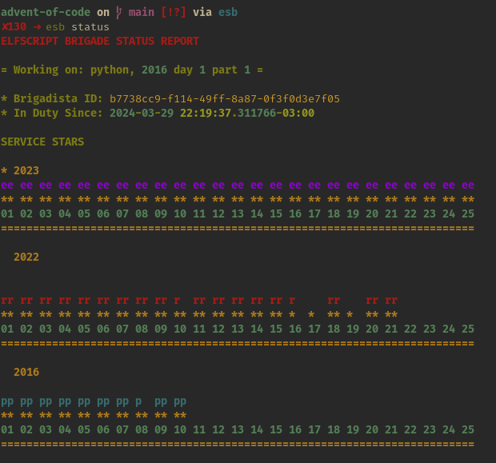

# ESB - ElfScript Brigade

> Script your way to rescue Christmas as part of the ElfScript Brigade team.
>
> This tool transforms Advent of Code into a CLI adventure


[](https://pypi.org/project/esb) [](https://pypi.org/project/esb) [](https://www.gnu.org/licenses/gpl-3.0.en.html)   

---

In the bureaucratic workshop of Santa's IT department, where the spirit of Christmas and the magic of coding converge, a special group of coding elves emerged known as the **ElfScript Brigade**. These skilled and whimsical elves were bestowed with the mission of safeguarding the joyous essence of Christmas through the power of scripting and coding.

`esb` is a CLI tool to help us _elves_ to save Christmas for the [Advent Of Code](https://adventofcode.com/) yearly events (Thank you [Eric 😉!](https://twitter.com/ericwastl)).

This tool allows us _elves_ to:

1. Fetch puzzle statement and puzzle data
2. Create language agnostic boilerplate code<sup>\*[Check supported languages](#currently-supported-languages)</sup>
3. Test run and submit solutions
4. Shiny dashboards
5. [Follow the rules of automation](#rules-of-automation)

> Check out an [example repo](https://github.com/luxedo/advent-of-code) created using `esb`!

## Table of Contents

- [Installation](##installation)
- [Usage](##usage)
- [Currently supported languages](#currently-supported-languages)
- [FAQ](#faq)
- [Rules of Automation](#rules-of-automation)
- [License](##license)

## Installation

```shell
pip install esb
```

## Usage

> ### TLDR;
>
> ```shell
> mkdir my_aoc_repo && cd my_aoc_repo
>
> # Initializes ESB repo
> esb init
>
> # Create boilerplate code and fetches input data
> esb start --lang rust --year 2023 --day 13
>
> # Code, code, code...
>
> # Run code and submit answer
> esb run --lang rust --year 2023 --day 13 --part 1 --submit
>
> # Collect stars!
> ```

### Initializing the repository

Create a `git` repository and initialize an `esb` repository too.

```shell
mkdir my_aoc_repo
cd my_aoc_repo
git init
esb init
git commit -m  "I now pledge to help, and I will forever help, saving christmas."
```

### Add your credentials

Set your credentials by locating your session cookie or save it in a `.env` file. If the cookie expires, you'll have to redo this step for fetching and submitting data.

```shell
export AOC_SESSION_COOKIE="<my_current_cookie>"
# Or
echo "<my_current_cookie>" > .env
```

How to find your Session Cookie? Check [SESSION_COOKIE.md](doc/SESSION_COOKIE.md).

### Fetching problems

Downloads puzzle statement, data and correct answers (if already solved).

```shell
esb fetch --year 2016 --day 9

# Hint: Use brace expansion for fetching multiple days or years
esb fetch --year 2023 --day {1..25}
```

Also fetches default testing files. Check [TESTING.md](doc/TESTING.md) for more information.

### Creating boilerplate code

Run `start` command to create code for the given language. It also fetches data if necessary

```shell
esb start --lang rust --year 2023 --day 13
```

### Running tests

Runs tests or selected tests with:

```shell
esb test --lang rust --year 2016 --day 9 --part 1
```

To select tests, pass `--filter` and select the test name:

```shell
esb test --lang rust --year 2016 --day 9 --part 1 --filter "test_01"
```

Check [TESTING.md](doc/TESTING.md) for more information.

### Running for real

Runs the code for the given input. Also can submit solutions.

```shell
esb run --lang rust --year 2016 --day 9 --part 1

# Run solution and then submit
esb run --lang rust --year 2016 --day 9 --part 1 --submit
```

> **💡 Hint**: `--lang`, `--year`, `--day` and `--part` arguments are cached.
>
> ```shell
> esb start --lang python --year 2018 --day 4
> esb test  # Will test the solution created above
> ```
>
> Check current cached arguments with `esb status` Eg:
>
> ```
> = Working on: python, 2018 day 4 part 1 =
> ```

### Check your progress in the command line

`esb status` shows current collected stars and some additional information.

```shell
esb status
```



### Viewing problem statement and inputs

To read the problem statements run `esb show`. The flags `--show-input` and `--show-test`
might be helpful for viewing the inputs.

```shell
esb show --year 2019 --day 19
```

### The dashboards

`esb` generates two dashboards.

1. A section in `README.md` to place a summary of the solutions;
2. A section in `REPORT.md` with detailed data on solution attempts and timing;

> ⚠️ Both files are editable and can be modified manually, except for the section in
> between the tags `<!-- Do not delete ...`.

The dashboards are updated automatically when solutions are correct. It's possible to generate
again by running:

```shell
esb dashboard
```

## Currently supported languages

Currently there are built in 3 supported languages. They set up the basic code for a
given day that allows `esb` to run and test solutions. Check the documentation
for each language and how to create your own boilerplate.

- Python
- Rust
- Elixir
- Go
- [_Create your own_](doc/BOILERPLATE.md)

Any program that supports the [FIREPLACEv1](doc/FIREPLACEv1.0.md) prococol can use `esb` tooling.

## FAQ

- **This tool is so stupid! I can hack my stats anytime I want!**

  > As _Acting Brigade Chief_, I have no powers nor will to enforce any regulatory actions against cheating. I leave this job to Santa's higher council and, of course, the guilt of leaving kids without their gifts.

- **Can I use this tool to bash the servers**

  > ## **No!**.

- **But, why python 3.11? What about my Debian friends?**

  > Because the developer wanted to some of the newest features.

- **You could steal my session cookies right?**

  > Yes, but I won't. Remember to read this code. Also, watch out for malicious dependencies.

- **I'd like to store the datababse and cache data**

  > Please don't store it publicly because it goes against [AoC's Code of Conduct](https://adventofcode.com/2023/about).
  > If you want to do it in private repos, just remove the `.cache` dir from `.gitignore`.

## Rules of Automation

ElfScript Brigade does follow the [automation guidelines](https://www.reddit.com/r/adventofcode/wiki/faqs/automation) on the [/r/adventofcode](https://www.reddit.com/r/adventofcode) community wiki
Specifically:

Once inputs are downloaded, they are cached locally in the `.cache` directory.

_⚠️ This cache data is `.gitignonre`'d along with the database used to track user progress.
If you wish to store this information, please do it in private repositores given that
sharing some of this data goes against the ["Code of Conduct"](https://adventofcode.com/about)
for AoC._

If you suspect your input is corrupted, you can manually request a fresh copy using `esb fetch ... --force`
The User-Agent header for the HTTP requests is set to me [@luxedo](https://github.com/luxedo)
since I maintain this tool :)

## License

> ESB - Script your way to rescue Christmas as part of the ElfScript Brigade team.
> Copyright (C) 2024 Luiz Eduardo Amaral <luizamaral306@gmail.com>
>
> This program is free software: you can redistribute it and/or modify
> it under the terms of the GNU General Public License as published by
> the Free Software Foundation, either version 3 of the License, or
> (at your option) any later version.
> This program is distributed in the hope that it will be useful,
> but WITHOUT ANY WARRANTY; without even the implied warranty of
> MERCHANTABILITY or FITNESS FOR A PARTICULAR PURPOSE. See the
> GNU General Public License for more details.
> You should have received a copy of the GNU General Public License
> along with this program. If not, see <http://www.gnu.org/licenses/>.
