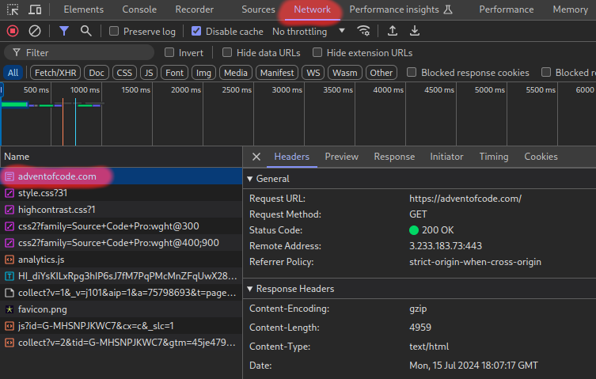
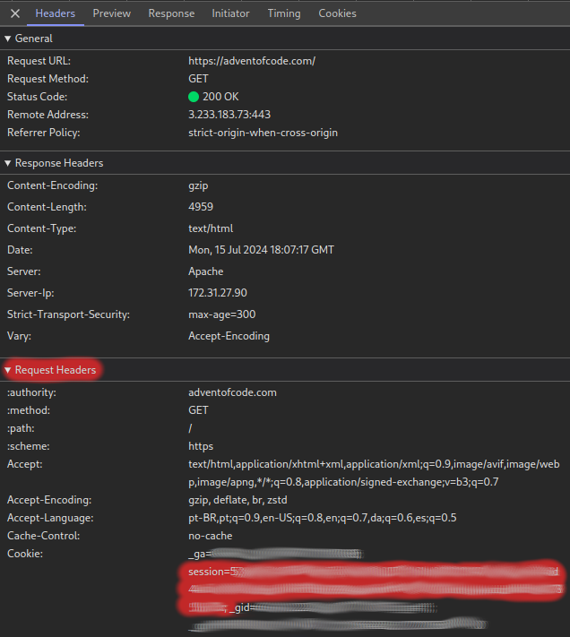

# Finding your Session Cookie

Some commands might require an authenticated connection with AoC servers to work.
To do so, a [Session Cookie](https://en.wikipedia.org/wiki/HTTP_cookie#Session_cookie)
is required.

Finding your _Session Cookie_ as is easy as:

1. Open a tab at https://adventofcode.com/ and login;
1. Open DevTools from your browser (Usually just press F12)
1. In the `Network` tab, find and click in a request to `adventofcode.com`. If it's not there, try reloading the page.
   
1. The _Session Cookie_ is located in the _Request Headers_ section in the _Cookie_ information;
   
1. Copy the cookie and create the AOC_SESSION_COOKIE environment variable for your shell;

```shell
export AOC_SESSION_COOKIE="<my_current_cookie>"
```

1. Happy solving! 🎅🎄❄️☃️🎁🦌
